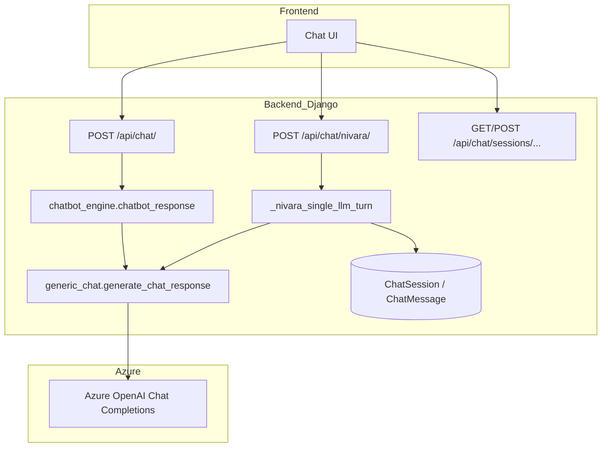
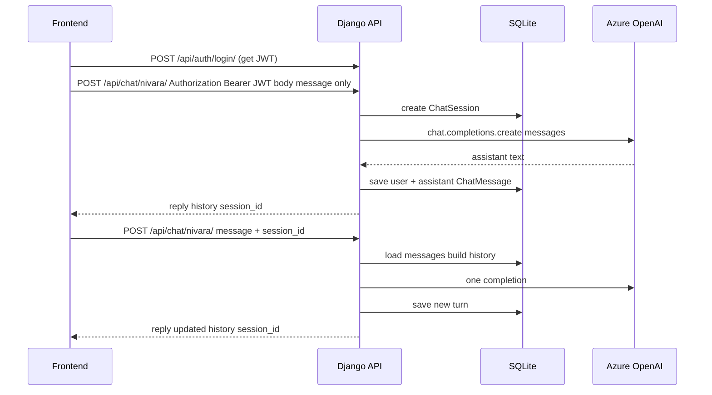
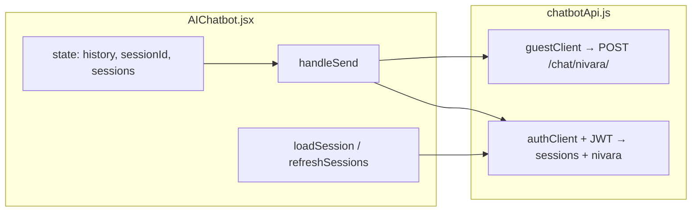
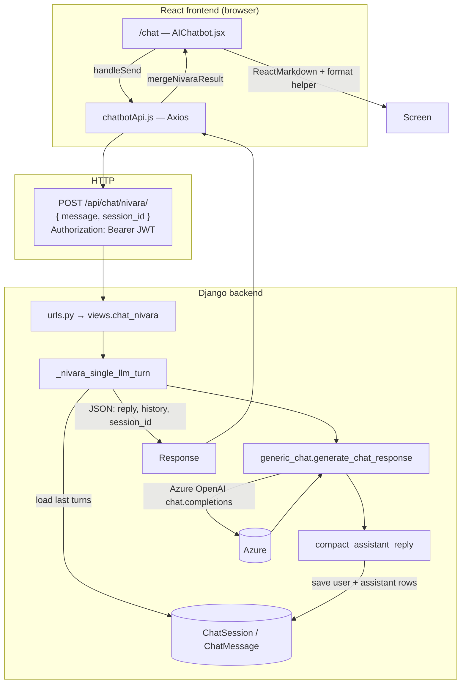

# Nivara — Chatbot & LLM Integration Workflow

This document describes **how the conversational chatbot works**, **where Azure OpenAI is used**, **how requests flow from the frontend to the LLM**, and **which HTTP endpoints** the client should call. It separates **chat** from **other LLM features** (lifestyle, report, mood insights). **Sections 1–15** focus on the **Django backend**; **sections 16–21** document the **Nivara React frontend** (`src/pages/AIChatbot/`) with file and line references; **section 22** is a compact **end-to-end workflow** from API to UI and back.

---

## 1. URL layout (how paths compose)

| Layer | Prefix | Example |
|--------|--------|---------|
| Django root (`NIVARA/urls.py`) | `api/` includes `nivara_app.urls` | — |
| App routes (`nivara_app/urls.py`) | `chat/`, `report/summary/`, … | — |
| **Full path** | | `http://<host>/api/chat/nivara/` |

**Note:** `report/summary/` and `report/summary/export/` are also registered **directly** on the project `urls.py` as `api/report/summary/` (same effective URL as `api/` + include would allow—your app uses the explicit project-level paths for those two).

---

## 2. Big picture: two “chat” surfaces vs other LLM features



**What this shows:** The **chat UI** can call three families of endpoints: legacy **`/api/chat/`** (stateless, goes through **`chatbot_response`** → **`generate_chat_response`**), main **`/api/chat/nivara/`** (goes through **`_nivara_single_llm_turn`**, which may read/write **`ChatSession`/`ChatMessage`** then call **`generate_chat_response`**), and **session REST** endpoints (list/create/load threads — **no LLM**). Every path that actually generates assistant text ends in **`generic_chat.generate_chat_response`**, which calls **Azure OpenAI** once per user message.

| Feature | Module | Endpoint(s) | LLM calls per user action |
|--------|--------|-------------|---------------------------|
| **Legacy single-turn chat** | `chatbot_engine.py` → `generic_chat.py` | `POST /api/chat/` | **1** |
| **Nivara chat (history)** | `views.py` → `generic_chat.py` | `POST /api/chat/nivara/` | **1** |
| **Session list / create** | `views.py` (no LLM) | `GET/POST /api/chat/sessions/` | **0** |
| **Load one conversation** | `views.py` (no LLM) | `GET /api/chat/sessions/<id>/` | **0** |
| **Lifestyle + report bundle** | `analysis.py` | `GET .../lifestyle/recommendations/`, `GET .../report/summary/`, etc. | **0–1** (cached) |
| **Mood insights (analysis schema)** | `analysis.py` | `GET /api/mood/insights-ai/` | **0–1** (cached) |

The rest of this document focuses on **chat**; section 12 summarizes **other LLM** usage.

---

## 3. Core LLM engine: `nivara_app/ai_engine/generic_chat.py`

### 3.1 Role

- Configures the **Azure OpenAI** client (`openai.AzureOpenAI`).
- Defines **system prompt** (`SYSTEM_PROMPT`) for the “Nivara” wellness persona.
- Exposes **`generate_chat_response(history_list, current_query) → str`**: the **only** place that calls the chat completion API for conversational text.

### 3.2 Environment variables (`.env`)

| Variable | Purpose |
|----------|---------|
| `AZURE_OPENAI_API_KEY` | Azure API key |
| `AZURE_OPENAI_ENDPOINT` | e.g. `https://<resource>.openai.azure.com/` |
| `AZURE_OPENAI_CHAT_DEPLOYMENT` | Deployment name (must match Azure portal) |
| `AZURE_OPENAI_API_VERSION` | API version (default `2024-02-15-preview` in code if unset) |

If `AZURE_OPENAI_CHAT_DEPLOYMENT` is missing, importing `generic_chat` **raises** `ValueError` at startup.

### 3.3 Single API call per message (cost model)

Inside `generate_chat_response`:

1. Validates and truncates the user message (`MAX_INPUT_CHARS = 1500`).
2. Keeps only the last **`MAX_HISTORY_TURNS = 8`** turns (each turn = user + assistant pair conceptually in the list you pass).
3. Builds `messages` for the API:
   - `[{ role: system, content: SYSTEM_PROMPT }, ...history as user/assistant pairs..., { role: user, content: current_query }]`
4. Calls **`client.chat.completions.create`** once:
   - `model=DEPLOYMENT_NAME`
   - `temperature=0.7`
   - `max_tokens=400`
   - `timeout=20`
5. Retries up to **`MAX_RETRIES = 3`** with exponential backoff on failure.
6. **Safety guard:** if the model reply contains certain **medical trigger words**, a short disclaimer is appended encouraging professional care.

**There is no second LLM call** for the same user message (no tool chains, no self-correction loop).

### 3.4 Optional in-process helper: `NivaraChat` class

Same file provides `NivaraChat` for **local Python testing** (`if __name__ == "__main__"`): it keeps `history` in memory and calls `generate_chat_response`. The **production web app** does not use this class; it uses Django views + DB or client-sent history.

---

## 4. Thin legacy wrapper: `nivara_app/ai_engine/chatbot_engine.py`

- **`chatbot_response(user_message: str)`**  
  - Imports **`generate_chat_response([], user_message)`** (empty history = single turn).  
  - Passes the result through **`compact_assistant_reply`** from `chat_formatting.py`.  
  - On any exception, returns a generic “temporarily unavailable” string.

Used only by **`POST /api/chat/`**.

---

## 5. Response formatting: `nivara_app/chat_formatting.py`

- **`compact_assistant_reply(text)`**  
  - Collapses repeated blank lines in the model output so the UI doesn’t show huge gaps.  
  - Skips processing if the text looks like an `[Error...]` message.

Applied to Nivara chat replies after `generate_chat_response` in **`_nivara_single_llm_turn`**, and in **`chatbot_response`** for the legacy endpoint.

---

## 6. Django models (`models.py`) — chat tables

Chat persistence is defined in **`nivara_app/models.py`** (see the block commented *“CHAT SESSIONS”*). Django maps each model to a real SQL table via `Meta.db_table`.

### 6.1 `ChatSession`

| Attribute | Type | Meaning |
|-----------|------|---------|
| `user` | `ForeignKey` → `User` | Owner of the thread; `on_delete=CASCADE` deletes sessions if the user is deleted. |
| `title` | `CharField(max_length=200)` | Short label for the UI (first user message is copied here on first save, truncated). |
| `created_at` | `DateTimeField(auto_now_add=True)` | When the session row was created. |
| `updated_at` | `DateTimeField(auto_now=True)` | Bumped when the view saves new messages. |

**`Meta`:** `db_table = "chat_sessions"`, default ordering `-updated_at` (newest threads first in lists).

### 6.2 `ChatMessage`

| Attribute | Type | Meaning |
|-----------|------|---------|
| `session` | `ForeignKey` → `ChatSession` | Thread this line belongs to; `related_name="messages"`. |
| `role` | `CharField(choices=…)` | `"user"` or `"assistant"` only. |
| `content` | `TextField` | Raw message text from the user or from the LLM (after `compact_assistant_reply`). |
| `created_at` | `DateTimeField(auto_now_add=True)` | Insert time. |

**`Meta`:** `db_table = "chat_messages"`, ordering `created_at`, `id` so messages replay in order.

**Relationship:** one `ChatSession` has many `ChatMessage` rows. The view always writes **two** rows per successful turn: user message, then assistant message.

### 6.3 How the tables were created (migrations)

Tables are **not** created by hand in SQL. They come from Django migrations:

- **File:** `nivara_app/migrations/0007_chat_sessions.py`  
- **Operations:** `CreateModel` for `ChatSession`, then `CreateModel` for `ChatMessage` with `ForeignKey` to `ChatSession`.  
- **Dependency:** `0006_phase7_doctor_consultation`.

After pulling the code, anyone runs:

```bash
python manage.py migrate
```

**What this does:** Runs Django’s migration engine from the project root (where **`manage.py`** lives). Pending migrations — including **`0007_chat_sessions`** — are applied so the database schema gains the **`chat_sessions`** and **`chat_messages`** tables in SQLite (or your configured DB). Run this after pulling code or adding migrations; it is **idempotent** for already-applied files.

### 6.4 Writes and SQLite locking

Session creation and message inserts from **`_nivara_single_llm_turn`** (and session **POST**) use **`sqlite_write()`** in **`nivara_app/db_retry.py`** so concurrent requests are less likely to hit “database is locked” on SQLite. That does not change the schema; it only wraps ORM writes.

---

## 7. Serializers (`serializers.py`) — chat

**There are no DRF serializers for chat in this project.**  
`grep` over `nivara_app/serializers.py` shows **no** `ChatSessionSerializer`, `ChatMessageSerializer`, or chat-related classes.

**Why:** the chat views build **plain Python dicts** and return them with `Response({...})`. Inputs are read with `request.data.get("message")`, `request.data.get("session_id")`, `request.data.get("history")` and validated inline (type checks, `int(session_id)`, empty message → 400).

**Implication for you:** if you want OpenAPI-style validation, nested serializers, or automatic field docs, you could later add serializers; today everything is **explicit in `views.py`**.

---

## 8. `views.py` — which code does what (detailed)

All symbols below live in **`nivara_app/views.py`** (line numbers are approximate; use search in the file if they drift).

| Lines (approx.) | Function / class | Responsibility |
|-----------------|------------------|----------------|
| **1476–1490** | `_chat_history_turns_from_db(session, max_turns=8)` | Loads `ChatMessage` rows for that session, keeps the last `max_turns * 2` messages, walks pairs `(user, assistant)` and builds the list format `generic_chat` expects: `[{"human_msg": "...", "ai_msg": "..."}, ...]`. Caps turns with `MAX_HISTORY_TURNS` from `generic_chat`. |
| **1493–1577** | `_nivara_single_llm_turn(request, message)` | **Core orchestrator** for Nivara chat: (1) lazy-imports `generate_chat_response` and handles missing `openai` with 503; (2) validates non-empty `message`; (3) resolves **session**: new `ChatSession` for authenticated user without `session_id`, or loads existing by `session_id`, or uses guest `history` from JSON body; (4) calls **`generate_chat_response(history, message)`** → **one** Azure call; (5) runs **`compact_assistant_reply`**; (6) if DB session and no error prefix, **`sqlite_write`** saves two `ChatMessage` rows and updates session `title`/`updated_at`; (7) returns JSON `reply`, `history`, and `session_id` when using DB. |
| **1460–1467** | `chat_with_ai` | **`POST /api/chat/`**. `AllowAny`. Reads `message`, calls **`chatbot_response`** (legacy engine), returns `{"response": ...}`. No DB, no session. |
| **1580–1590** | `chat_nivara` | **`POST /api/chat/nivara/`**. `AllowAny`. Thin wrapper: passes `request.data.get("message")` into **`_nivara_single_llm_turn`**. |
| **1593–1626** | `ChatSessionsView` | **`GET/POST /api/chat/sessions/`**. `IsAuthenticated`. **GET:** lists up to 100 sessions for `request.user` as dicts (`id`, `title`, timestamps). **POST:** creates empty `ChatSession` via `sqlite_write`, returns `session_id`. **No LLM.** |
| **1629–1654** | `ChatSessionDetailView` | **`GET /api/chat/sessions/<session_id>/`**. `IsAuthenticated`. Loads session + all messages ordered by `id`, returns `messages` as `{role, content, created_at}`. **No LLM.** |

### 8.1 Imports used only for chat (in `views.py`)

- **`ChatSession`, `ChatMessage`** from `.models`  
- **`chatbot_response`** from `.ai_engine.chatbot_engine`  
- **`sqlite_write`** from `.db_retry` (writes after LLM success / session create)  
- Inside helpers: **`generate_chat_response`**, **`MAX_HISTORY_TURNS`** from `.ai_engine.generic_chat`; **`compact_assistant_reply`** from `.chat_formatting`

---

## 9. Django views: chat HTTP API (quick reference)

All paths below assume base **`/api/`** (see section 1).

### 9.1 `POST /api/chat/` — legacy, anonymous-friendly

| Item | Detail |
|------|--------|
| **View** | `chat_with_ai` |
| **Permission** | `AllowAny` |
| **Body** | `{ "message": "<user text>" }` |
| **Flow** | `chatbot_response` → `generate_chat_response([], message)` → **1 Azure call** |
| **Response** | `{ "response": "<assistant text>" }` |
| **History** | None (stateless). |

**Frontend use:** simplest integration; no JWT, no session id. Not ideal for multi-turn memory unless the client resends context (not supported by this endpoint).

---

### 9.2 `POST /api/chat/nivara/` — main Nivara chat (recommended)

| Item | Detail |
|------|--------|
| **View** | `chat_nivara` → `_nivara_single_llm_turn` |
| **Permission** | `AllowAny` (works for guests **and** logged-in users) |
| **Body (typical)** | `{ "message": "<user text>", ... }` (see modes below) |
| **Flow** | Build `history` → `generate_chat_response(history, message)` → **1 Azure call** → `compact_assistant_reply` → optionally save to DB |
| **Response** | `{ "reply": "...", "history": [ { "human_msg", "ai_msg" }, ... ] }` and, when using DB, `{ "session_id": <int>, ... }` |

#### Mode A — **Logged-in user** (JWT), **no `session_id` in body**

- Creates a **new** `ChatSession` for that user (via `sqlite_write`).
- `history` starts empty.
- Response includes **`session_id`** for follow-up messages.

#### Mode B — **Logged-in user** + **`session_id`**

- Loads session; builds `history` from **`ChatMessage`** rows via `_chat_history_turns_from_db` (pairs user+assistant, capped by `MAX_HISTORY_TURNS`).
- Appends new user + assistant messages after a successful reply.

#### Mode C — **Guest** (not authenticated)

- **`history`** must be sent in the body as a list of `{ "human_msg", "ai_msg" }` objects.
- No `session_id`; persistence is **client-side only** (client must send updated `history` each time).

#### Error handling

- If `openai` is not installed, may return **503** with install hint.
- Empty `message` → **400**.
- Invalid / missing session for logged-in user → **404** / **400** as applicable.

---

### 9.3 `GET /api/chat/sessions/` — list sessions (auth only)

| Item | Detail |
|------|--------|
| **View** | `ChatSessionsView.get` |
| **Permission** | `IsAuthenticated` |
| **LLM** | None |
| **Response** | `{ "count", "sessions": [ { id, title, updated_at, created_at } ] }` |

---

### 9.4 `POST /api/chat/sessions/` — create empty session (auth only)

| Item | Detail |
|------|--------|
| **View** | `ChatSessionsView.post` |
| **Permission** | `IsAuthenticated` |
| **LLM** | None |
| **Response** | `{ "session_id", "message": "..." }` (201) |

**Note:** Starting a chat **without** calling this first is still OK: the first `POST /api/chat/nivara/` without `session_id` **creates** a session automatically.

---

### 9.5 `GET /api/chat/sessions/<session_id>/` — load full thread (auth only)

| Item | Detail |
|------|--------|
| **View** | `ChatSessionDetailView.get` |
| **Permission** | `IsAuthenticated` |
| **LLM** | None |
| **Response** | `{ "session_id", "title", "updated_at", "messages": [ { role, content, created_at }, ... ] }` |

Use this to **hydrate the UI** when the user opens an old conversation.

---

## 10. End-to-end sequence (recommended frontend: logged-in user)



**What this shows:** A **happy path** for a logged-in user. First the client obtains a **JWT** (login). The **first** chat request may include only **`message`**; the API **creates** a session row, calls the **LLM** once, **persists** user + assistant messages, and returns **`reply`**, **`history`**, and **`session_id`**. **Later** requests send **`message` + `session_id`**; the API **reloads** prior turns from the DB, calls the **LLM** again, **appends** the new pair to the DB, and returns updated **`reply`/`history`**. The React app often creates the session explicitly first (**§16**); the diagram still matches the backend’s ability to create on first **`nivara`** call.

---

## 11. Frontend integration checklist (generic client)

The **Nivara React app** implements this checklist in `chatbotApi.js` and `AIChatbot.jsx` — see **section 16** for the concrete mapping.

### 11.1 Headers

- **Authenticated chat:**  
  `Authorization: Bearer <access_token>`  
  `Content-Type: application/json`

### 11.2 Which endpoint should the UI use?

| Goal | Endpoint |
|------|----------|
| Quick demo, no auth | `POST /api/chat/` or guest mode `POST /api/chat/nivara/` with `history` array |
| Production chat with saved threads | `POST /api/chat/nivara/` + JWT; store `session_id` after first reply |
| Sidebar “past chats” | `GET /api/chat/sessions/` |
| Open existing thread | `GET /api/chat/sessions/<id>/` then show `messages`; continue with `POST .../nivara/` + `session_id` |

### 11.3 Example bodies

**First message (logged-in, auto-new session):**

```json
{ "message": "What helps with period cramps?" }
```

**What this does:** Tells the backend “here is the user’s text only.” For a **JWT-authenticated** request **without** `session_id`, the view **creates a new `ChatSession`**, runs the LLM with **empty** prior history, saves the turn, and returns **`session_id`** plus **`reply`** / **`history`**.

**Follow-up:**

```json
{ "message": "Any gentle teas?", "session_id": 12 }
```

**What this does:** Identifies an **existing** thread (**`12`**). The server loads recent **`ChatMessage`** rows for that session, builds **`history`** for the LLM, generates the next reply, saves the new user + assistant rows, and returns an updated **`history`** (and the same **`session_id`**).

**Guest:**

```json
{
  "message": "Hello",
  "history": []
}
```

**What this does:** **No JWT**: the server cannot load a DB session. **`history`** is the **entire** prior conversation in **`{ human_msg, ai_msg }`** form; **`[]`** means first turn. The LLM sees no prior context beyond what you send.

After response, send back the **`history`** array from the response on the next request.

### 11.4 CORS

Backend allows origins such as `http://localhost:3000` (see `NIVARA/settings.py` — `CORS_ALLOWED_ORIGINS`). Adjust for your deployed frontend URL.

---

## 12. Other LLM usage in the same project (not the chatbot)

These use **`nivara_app/ai_engine/analysis.py`** (and related views), **not** `generic_chat.py`:

| Capability | Typical endpoint | Notes |
|------------|------------------|--------|
| Mood insights (narrative + care buckets) | `GET /api/mood/insights-ai/?days=30` | Uses `analyze_user_wellness`; cached per user/days. |
| Lifestyle cards + report narrative bundle | `GET /api/lifestyle/recommendations/?days=30`, `GET /api/report/summary/?days=30`, export, booking report | Single bundle LLM call cached (`lifestyle` + `report_narrative` style fields merged into report). |

Chat **does not** call `analysis.py`. Analysis features **do not** use `generate_chat_response`.

---

## 13. Local testing (terminal)

**Chat module smoke test (no Django):**

```bash
cd <project_root>
python nivara_app/ai_engine/generic_chat.py
```

**What this does:** Changes to the Django project root, then executes **`generic_chat.py`** as a **standalone script** (its **`if __name__ == "__main__"`** block). That exercises **`generate_chat_response`** and the **`NivaraChat`** helper **without** HTTP or the database — useful to verify Azure credentials and model output quickly.

**Requires:** `.env` with Azure variables, `pip install openai python-dotenv`.

**Full API:** run `python manage.py runserver` and use Postman/Thunder Client against `/api/chat/nivara/` with a JSON body.

---

## 14. File reference summary

| File | Responsibility |
|------|----------------|
| `nivara_app/ai_engine/generic_chat.py` | Azure client, system prompt, `generate_chat_response`, retries, medical suffix |
| `nivara_app/ai_engine/chatbot_engine.py` | Legacy wrapper for `/api/chat/` |
| `nivara_app/chat_formatting.py` | `compact_assistant_reply` |
| `nivara_app/views.py` | `chat_with_ai`, `chat_nivara`, `_nivara_single_llm_turn`, `_chat_history_turns_from_db`, `ChatSessionsView`, `ChatSessionDetailView` (no chat serializers) |
| `nivara_app/serializers.py` | **No chat serializers** — chat uses manual dicts in views |
| `nivara_app/migrations/0007_chat_sessions.py` | Creates `chat_sessions` and `chat_messages` tables |
| `nivara_app/urls.py` | Routes under `api/` |
| `NIVARA/urls.py` | Includes `api/` + explicit report routes |
| `nivara_app/models.py` | `ChatSession`, `ChatMessage` |
| `nivara_app/db_retry.py` | `sqlite_write` for safer SQLite writes |

---

## 15. Security & product notes

- Chat endpoints are **`AllowAny`** by design for guest mode; for production you may want to **restrict** or **rate-limit** anonymous chat.
- The model is instructed **not to diagnose**; triggers add a **disclaimer** when certain words appear in the **model output** (not a clinical filter on input).
- **JWT** for session APIs and authenticated chat persistence should be stored securely on the client (httpOnly cookies vs memory — frontend choice).

---

## 16. React frontend — overview

The chat UI lives under **`nivara/src/pages/AIChatbot/`**. It talks to the same Django API described above (`/api/chat/nivara/`, `/api/chat/sessions/`, …). The page is mounted at **`/chat`** in the router.

```81:81:nivara/src/App.js
            <Route path="/chat" element={<AIChatbot />} />
```

**What this does:** Registers the URL path **`/chat`** with React Router so visiting `http://localhost:3000/chat` (or your deployed origin + `/chat`) mounts the **`AIChatbot`** page component inside the app shell (navbar, main layout, etc.).

Entry points from the rest of the app include the dashboard card linking to `/chat` (`nivara/src/pages/Dashboard/Dashboard.jsx`).

### 16.1 Module map

| Path | Role |
|------|------|
| `AIChatbot.jsx` | Page: state, send/load flows, guest vs auth, markdown + TTS + mic |
| `chatbotApi.js` | Axios clients, endpoints, response helpers |
| `hooks/useSpeechVoice.js` | Web Speech API TTS (read-aloud) |
| `utils/nivaraReplyFormat.js` | Sanitize assistant text for `react-markdown` |
| `components/ChatSidebar.jsx` | Session list (authenticated only) |
| `components/ReadAloudBar.jsx` | Toggle auto read-aloud on new replies |
| `components/SupportiveRobo.jsx` | Header mascot |
| `AIChatbot.css`, component CSS | Layout and styling |

### 16.2 High-level frontend flow



**What this shows:** User actions on the page (**send message**, **pick a session**, **refresh list**) all go through functions in **`AIChatbot.jsx`**, which call **`chatbotApi.js`**. Guests only use the **guest** path (`POST /chat/nivara/` with `history`). Signed-in users use the **auth** path (JWT on **`authClient`**) for listing/creating sessions, loading a thread, and posting each new message with **`session_id`**.

---

## 17. HTTP client: `chatbotApi.js`

**Base URL:** `http://localhost:8000/api` (constant `API_BASE_URL`). For production, change this constant or refactor to `process.env.REACT_APP_API_URL` so it matches your deployed Django host and CORS settings.

Two Axios instances avoid sending a JWT on guest chat (keeps guest requests clean and matches **AllowAny** guest mode):

```9:27:nivara/src/pages/AIChatbot/chatbotApi.js
const API_BASE_URL = "http://localhost:8000/api";

/** Guest — never sends Authorization (CORS + no JWT for /chat/nivara/) */
const guestClient = axios.create({
  baseURL: API_BASE_URL,
  headers: { "Content-Type": "application/json" },
});

/** JWT for sessions + session-scoped chat */
const authClient = axios.create({
  baseURL: API_BASE_URL,
  headers: { "Content-Type": "application/json" },
});

authClient.interceptors.request.use((config) => {
  const token = localStorage.getItem("access_token");
  if (token) config.headers.Authorization = `Bearer ${token}`;
  return config;
});
```

**What this does:**

- **`API_BASE_URL`** — Prefix for every request (`/chat/...` is appended). Must match your Django server’s **`/api`** mount.
- **`guestClient`** — Sends JSON only. **Never** attaches `Authorization`, so guest chat works without a token and matches the backend’s guest mode.
- **`authClient`** — Same JSON defaults, but a **request interceptor** runs before each call: it reads **`access_token`** from **`localStorage`** (set at login elsewhere in the app) and, if present, sets **`Authorization: Bearer <token>`**. Session list/create/detail and authenticated **`nivara`** calls therefore automatically include the JWT.

### 17.1 Endpoints wrapped

| Function | Method + path | Body / notes |
|----------|---------------|--------------|
| `postNivaraGuest` | `POST /chat/nivara/` | `{ message, history }` — **no** `Authorization` |
| `postNivaraWithSession` | `POST /chat/nivara/` | `{ message, session_id }` — **snake_case** matches Django |
| `createChatSession` | `POST /chat/sessions/` | JWT required |
| `listChatSessions` | `GET /chat/sessions/` | JWT required |
| `getChatSession` | `GET /chat/sessions/:id/` | JWT required |

```29:45:nivara/src/pages/AIChatbot/chatbotApi.js
export const postNivaraGuest = (message, history = []) =>
  guestClient.post("/chat/nivara/", { message, history }).then((r) => r.data);

/** Logged-in: omit history; backend loads thread by session */
export const postNivaraWithSession = (message, sessionId) =>
  authClient
    .post("/chat/nivara/", { message, session_id: sessionId })
    .then((r) => r.data);

export const createChatSession = (body = {}) =>
  authClient.post("/chat/sessions/", body).then((r) => r.data);

export const listChatSessions = () =>
  authClient.get("/chat/sessions/").then((r) => r.data);

export const getChatSession = (sessionId) =>
  authClient.get(`/chat/sessions/${sessionId}/`).then((r) => r.data);
```

**What each export does:**

- **`postNivaraGuest`** — One guest turn: sends the latest **`message`** plus the full client-held **`history`** array. Axios returns **`r.data`** (parsed JSON body) so callers get the object directly.
- **`postNivaraWithSession`** — One signed-in turn: sends **`message`** and **`session_id`** (snake_case so Django’s view can read it). The server loads prior messages from the DB; the client does **not** send `history`.
- **`createChatSession`** — **`POST /chat/sessions/`** with an empty or optional body; response includes **`session_id`** for a new empty thread.
- **`listChatSessions`** — **`GET`** all threads for the current user (for the sidebar).
- **`getChatSession`** — **`GET`** one thread by id; response includes **`messages`** (or compatible shapes) for hydration.

### 17.2 Normalizing backend shapes for the UI

The UI renders turns as **`{ human_msg, ai_msg }[]`**. `GET /api/chat/sessions/<id>/` returns `messages` with **`role`** / **`content`**. `normalizeSessionThread` converts either shape into turn pairs:

```50:82:nivara/src/pages/AIChatbot/chatbotApi.js
export function normalizeSessionThread(data) {
  if (!data) return [];
  if (Array.isArray(data.history) && data.history.length) {
    const h = data.history[0];
    if (h && (h.human_msg != null || h.ai_msg != null)) return data.history;
  }
  if (Array.isArray(data.messages)) {
    const m = data.messages;
    if (m.length && m[0]?.human_msg != null) return m;
    const turns = [];
    for (let i = 0; i < m.length; i++) {
      const row = m[i];
      if (row.human_msg != null && row.ai_msg != null) {
        turns.push({ human_msg: row.human_msg, ai_msg: row.ai_msg });
        continue;
      }
      const role = String(row.role || row.sender || "").toLowerCase();
      const text = row.content ?? row.text ?? row.message ?? "";
      if (role === "user" || role === "human") {
        const next = m[i + 1];
        const nRole = String(next?.role || next?.sender || "").toLowerCase();
        if (next && (nRole === "assistant" || nRole === "ai")) {
          turns.push({
            human_msg: text,
            ai_msg: next.content ?? next.text ?? next.message ?? "",
          });
          i++;
        }
      }
    }
    if (turns.length) return turns;
  }
  return [];
}
```

**What this does (step by step):**

1. **Empty input** — Returns `[]` if `data` is missing.
2. **`history` shortcut** — If the API already returned **`data.history`** as an array of `{ human_msg, ai_msg }` objects (same shape as **`postNivaraGuest`** responses), return it unchanged.
3. **`messages` as turn pairs** — If each row already has both **`human_msg`** and **`ai_msg`**, return that array as-is.
4. **`messages` as chat rows** — Otherwise walk the list in order. For each **`user`/`human`** row, look at the **next** row; if it is **`assistant`/`ai`**, pair them into one `{ human_msg, ai_msg }` and skip the assistant row on the next iteration. This matches Django’s **`{ role, content }`** list from **`GET .../sessions/<id>/`**.
5. **Fallback** — If nothing matched, return `[]` so the UI shows an empty thread instead of crashing.

Helpers used whenever the UI reads API JSON:

```85:96:nivara/src/pages/AIChatbot/chatbotApi.js
export function extractSessionId(res) {
  if (res == null) return null;
  const id = res.session_id ?? res.sessionId ?? res.id;
  return id != null ? Number(id) || id : null;
}

export function extractSessionsList(res) {
  if (Array.isArray(res)) return res;
  if (Array.isArray(res?.sessions)) return res.sessions;
  if (Array.isArray(res?.results)) return res.results;
  return [];
}
```

**What this does:** **`extractSessionId`** picks the thread id from a response object whether Django named it **`session_id`**, **`sessionId`**, or **`id`**, and normalizes to a number when possible (so **`12`** and **`"12"`** both work). **`extractSessionsList`** unwraps a **GET sessions** payload whether the backend returned a bare array, **`{ sessions: [...] }`**, or **`{ results: [...] }`**, so the sidebar always receives a plain array (or **`[]`** if unknown).

---

## 18. Page logic: `AIChatbot.jsx`

### 18.1 Authentication detection

The page treats the user as signed in when **`localStorage.getItem("access_token")`** is truthy (same key the Axios interceptor uses). This mirrors login flows elsewhere in the app that persist the JWT under `access_token`.

```49:49:nivara/src/pages/AIChatbot/AIChatbot.jsx
  const isAuthed = !!localStorage.getItem("access_token");
```

**What this does:** Reads the JWT string the login flow stored under **`access_token`**. The **`!!`** converts it to a strict boolean: **truthy** if a non-empty string exists (treat as logged in), **falsy** if missing or empty (guest). This value drives which branch runs in **`handleSend`**, whether the session sidebar renders, and whether session APIs are called. It is **not** reactive to token expiry until something causes a re-render or the key is cleared (e.g. logout).

When auth disappears, effects clear `sessionId`, `history`, and `sessions` so the UI drops back to guest mode.

### 18.2 State model

- **`history`** — array of `{ human_msg, ai_msg }` for the active thread (guest or loaded session).
- **`sessionId`** — numeric (or coercible) id for authenticated chat; `null` until a session exists.
- **`sessions`** — sidebar list from `GET /chat/sessions/`.
- **`loading`**, **`inputMessage`**, **`readAloud`**, **`sidebarOpen`**, etc. — UX only.

### 18.3 Sending a message (`handleSend`)

1. Trims input; guards empty / double-submit.
2. **Authenticated:** If there is no `sessionId`, calls **`createChatSession`** first, stores `session_id`, refreshes the sidebar, then **`postNivaraWithSession(message, sid)`**. This is a deliberate UX choice: the thread exists in the DB before the first LLM turn (backend **§9.4** notes the first `nivara` call could also create a session without a prior `POST /sessions/`).
3. **Guest:** **`postNivaraGuest(message, history)`** — sends the full in-memory `history` each time (**backend mode C, §9.2**).
4. **`mergeNivaraResult`** prefers the server’s `history` array when present; otherwise appends one synthetic turn from `reply`.
5. Optional **read-aloud** on the new assistant text if enabled.

```142:204:nivara/src/pages/AIChatbot/AIChatbot.jsx
  const mergeNivaraResult = (message, data, prevHistory) => {
    if (Array.isArray(data.history) && data.history.length) {
      const first = data.history[0];
      if (first && (first.human_msg != null || first.ai_msg != null))
        return data.history;
    }
    const reply = data.reply ?? data.message ?? "";
    return [...prevHistory, { human_msg: message, ai_msg: reply }];
  };

  const handleSend = async () => {
    const message = inputMessage.trim();
    if (!message || loading) return;

    setInputMessage("");
    setLoading(true);

    try {
      let data;
      if (isAuthed) {
        let sid = sessionId;
        if (sid == null) {
          const created = await chatbotApi.createChatSession({});
          sid = extractSessionId(created);
          if (sid == null) throw new Error("No session_id from server");
          setSessionId(sid);
          await refreshSessions();
        }
        data = await chatbotApi.postNivaraWithSession(message, sid);
        refreshSessions();
      } else {
        data = await chatbotApi.postNivaraGuest(message, history);
      }
      const sidFromReply = extractSessionId(data);
      if (sidFromReply != null) setSessionId(sidFromReply);
      setHistory((prev) => mergeNivaraResult(message, data, prev));
      const replyText =
        data.reply ||
        (Array.isArray(data.history) && data.history.length
          ? data.history[data.history.length - 1]?.ai_msg
          : "");
      if (readAloud && replyText) {
        speak(replyText, `auto-${Date.now()}`);
      }
    } catch (err) {
      console.error("Chatbot error:", err);
      const status = err.response?.status;
      const detail =
        err.response?.data?.detail ||
        err.message ||
        "Something went wrong. Please try again.";
      if (!err.response) {
        showToast("Network error — check that the server is running.");
      } else if (status >= 500) {
        showToast("Server error — please try again later.");
      } else {
        showToast(typeof detail === "string" ? detail : "Request failed.");
      }
      setInputMessage(message);
    } finally {
      setLoading(false);
    }
  };
```

**What this code does (line by line in spirit):**

- **`mergeNivaraResult`** — After a successful API response, decides what the new **`history`** array should be. If the server returned a full **`data.history`** in turn format, **replace** local history with that (authoritative). Otherwise take **`data.reply`** or **`data.message`**, append one new pair **`{ human_msg: message, ai_msg: reply }`** to **`prevHistory`** (fallback when the backend omits a full history array).
- **`handleSend`** — Clears the input and sets **`loading`**. **Authenticated path:** ensures a **`sessionId`** exists by creating a session if needed, then posts the message with **`postNivaraWithSession`** and refreshes the sidebar. **Guest path:** posts with **`postNivaraGuest`**, passing current **`history`** so the server can continue context. Then updates **`sessionId`** from the response if present, merges **`history`**, and if **read-aloud** is on, speaks the latest assistant text with a unique key (`auto-<timestamp>`). **`catch`** maps errors to user-facing toasts (network vs server vs other) and **restores the message** into the input so nothing is lost. **`finally`** always clears **`loading`**.

Errors distinguish **network**, **5xx**, and **4xx** (e.g. 401 on session create → toast from `startNewSession`: “Please log in to save chat sessions.”).

### 18.4 Session sidebar and loading a thread

- **`refreshSessions`** — `listChatSessions` + `extractSessionsList` (authenticated).
- **`loadSession`** — `getChatSession(id)`, then `setSessionId` + `setHistory(normalizeSessionThread(data))`.
- **`startNewSession` / handleNewChat (auth)** — `createChatSession`, clear thread state, refresh list.
- **Guest “New chat”** — clears local `history` only (no server thread).

```217:236:nivara/src/pages/AIChatbot/AIChatbot.jsx
  const loadSession = async (id) => {
    if (!id || loading) return;
    stopSpeaking();
    setLoading(true);
    try {
      const data = await chatbotApi.getChatSession(id);
      setSessionId(extractSessionId(data) ?? id);
      setHistory(normalizeSessionThread(data));
      isFirstScrollAfterMount.current = true;
      if (window.innerWidth < 900) setSidebarOpen(false);
    } catch (err) {
      showToast(
        err.response?.status === 404
          ? "That chat was not found."
          : err.response?.data?.detail || "Could not load chat."
      );
    } finally {
      setLoading(false);
    }
  };
```

**What this does:** When the user picks a thread in the sidebar, **`loadSession`** fetches that conversation from the server. It **stops any TTS** first, shows loading, then **`getChatSession(id)`** loads the JSON. **`setSessionId`** keeps the active id in sync (from the response or the clicked **`id`**). **`normalizeSessionThread`** turns the API’s **`messages`/`history`** into **`{ human_msg, ai_msg }[]`** for the same list UI used for guest chat. **`isFirstScrollAfterMount`** resets scroll behavior so the thread doesn’t jump oddly. On **narrow screens** (`< 900px`), the sidebar **closes** after selection so the message column has space. Errors **404** vs other are surfaced via **`showToast`**.

---

## 19. Presentation and accessibility extras

### 19.1 Markdown rendering

Assistant bubbles use **`react-markdown`** with **`remark-gfm`**. Raw model text is passed through **`formatNivaraAssistantMarkdown`** to strip or normalize HTML-like fragments so markdown parses predictably:

```1:12:nivara/src/pages/AIChatbot/utils/nivaraReplyFormat.js
/** Strip HTML / odd escapes so ReactMarkdown gets plain markdown text. */
export function formatNivaraAssistantMarkdown(raw) {
  if (raw == null) return "";
  let s = String(raw).replace(/\r\n/g, "\n");
  if (!s.includes("\n") && /\\n/.test(s)) s = s.replace(/\\n/g, "\n");
  s = s.replace(/<br\s*\/?>/gi, "\n");
  s = s.replace(/<\/(p|div|li|h[1-6])>/gi, "\n");
  s = s.replace(/<li[^>]*>/gi, "\n- ");
  s = s.replace(/<[^>]+>/g, "");
  s = s.replace(/&nbsp;/g, " ").replace(/&amp;/g, "&").replace(/&lt;/g, "<").replace(/&gt;/g, ">");
  return s.replace(/\n{3,}/g, "\n\n").trim();
}
```

**What this does:** The model sometimes returns **HTML-ish snippets**, escaped newlines (`\n` as text), or `&nbsp;` entities. **`ReactMarkdown`** expects **markdown**, not raw tags. This helper **normalizes line endings**, turns **`<br>`** and common block closings into **newlines**, converts **`<li>`** into markdown **list markers**, **strips remaining tags**, **decodes common HTML entities** to real characters, and **collapses** excessive blank lines. The result is safer, more predictable markdown for lists, bold, links, etc.

Usage in the message list (per turn):

```406:409:nivara/src/pages/AIChatbot/AIChatbot.jsx
                        <div className="message-bubble assistant-bubble nivara-reply">
                          <ReactMarkdown remarkPlugins={[remarkGfm]}>
                            {formatNivaraAssistantMarkdown(turn.ai_msg)}
                          </ReactMarkdown>
                        </div>
```

**What this does:** For each assistant turn, the bubble content is **not** plain text: it is rendered by **`ReactMarkdown`** with **`remarkGfm`** (GitHub-flavored markdown: tables, task lists, strikethrough, etc.). The **`formatNivaraAssistantMarkdown(turn.ai_msg)`** call runs **first** on the raw string so the markdown parser sees clean input. Styling comes from CSS classes on the wrapper (**`nivara-reply`**, **`assistant-bubble`**).

### 19.2 Read aloud (TTS)

`useSpeechVoice` uses the browser **`SpeechSynthesisUtterance`** API, prefers a female voice when available (including en-IN–friendly heuristics), and strips markdown before speaking. Per-message and “auto on last reply” controls are wired in `AIChatbot.jsx`.

### 19.3 Voice input (STT)

Optional dictation uses **`window.SpeechRecognition` / `webkitSpeechRecognition`** with `lang = "en-IN"`, non-continuous mode, appending transcript into the textarea (`toggleMic`).

### 19.4 Sidebar

When authenticated, **`ChatSidebar`** lists `sessions`, highlights `sessionId`, and calls **`onSelectSession`** → `loadSession`. Collapse behavior on narrow viewports is handled in `loadSession` and header toggle buttons.

---

## 20. Frontend vs backend checklist (mapping)

| Backend doc § | Frontend implementation |
|---------------|-------------------------|
| **§9.2** guest `history` | `postNivaraGuest` + `handleSend` guest branch |
| **§9.2** auth `session_id` | `postNivaraWithSession` body `{ session_id }` |
| **§9.3–9.5** session CRUD + load | `listChatSessions`, `createChatSession`, `getChatSession` |
| **§11.1** JWT header | `authClient` interceptor + `localStorage` `access_token` |
| **§11.4** CORS | Dev: Django allows `localhost:3000`; set `API_BASE_URL` + CORS for deploy |

**Not used by this React page:** `POST /api/chat/` (legacy `chat_with_ai`). The older `components/Chatbot.jsx` still contains commented references to that URL; the live route is **`/chat`** → **`AIChatbot`**.

---

## 21. File reference — frontend (this repo)

| File | Responsibility |
|------|----------------|
| `src/pages/AIChatbot/AIChatbot.jsx` | Main page: auth/guest flows, merge history, UI |
| `src/pages/AIChatbot/chatbotApi.js` | Axios, endpoints, `normalizeSessionThread`, id helpers |
| `src/pages/AIChatbot/hooks/useSpeechVoice.js` | TTS |
| `src/pages/AIChatbot/utils/nivaraReplyFormat.js` | Assistant text cleanup for markdown |
| `src/pages/AIChatbot/components/*.jsx` + `.css` | Sidebar, read-aloud bar, mascot |
| `src/App.js` | Route `/chat` → `AIChatbot` |

---

## 22. End-to-end workflow (backend ↔ frontend)

This section ties the stack together in one pass: **what runs where** when someone sends a chat message in the Nivara React app against the Django API.

### 22.1 Flow diagram (one message, signed-in user)



**How to read it (backend → frontend direction):** The **HTTP response** is built in **`_nivara_single_llm_turn`**: after **Azure** returns text, **`compact_assistant_reply`** cleans it, the view **writes** to **SQLite** (via **`sqlite_write`**), then returns **`reply`**, **`history`**, and **`session_id`**. **Axios** delivers that JSON to the browser; **`mergeNivaraResult`** updates **`history`** state; React **re-renders** bubbles and runs **`formatNivaraAssistantMarkdown`** + **`ReactMarkdown`** for the assistant line.

### 22.2 Same path in short steps

| Step | Layer | What happens |
|------|--------|----------------|
| 1 | **Frontend** | User types and sends; **`handleSend`** chooses guest vs auth and calls **`postNivaraGuest`** or **`postNivaraWithSession`**. |
| 2 | **Network** | **`POST /api/chat/nivara/`** with JSON body; auth client adds **`Bearer`** token when **`access_token`** exists in **`localStorage`**. |
| 3 | **Django routing** | Request hits **`chat_nivara`**, which delegates to **`_nivara_single_llm_turn`**. |
| 4 | **Backend logic** | Resolves **session** (DB thread or guest **`history`** from body), builds **`history`** list for the LLM (from DB or client). |
| 5 | **LLM** | **`generate_chat_response`** calls **Azure OpenAI** once; optional medical-disclaimer suffix on the string. |
| 6 | **Backend persistence** | Reply passed through **`compact_assistant_reply`**; for DB sessions, **two** **`ChatMessage`** rows inserted (user, assistant). |
| 7 | **Response** | JSON back to the client with **`reply`** and usually **`history`** in **`{ human_msg, ai_msg }`** form (+ **`session_id`** when using DB). |
| 8 | **Frontend** | **`setHistory`** from **`mergeNivaraResult`**; optional **TTS**; sidebar may **`refreshSessions`** after auth sends. |

### 22.3 Guest vs signed-in (same backend, different frontend branch)

| | **Guest** | **Signed in** |
|--|-----------|----------------|
| **Axios** | **`guestClient`** — no JWT | **`authClient`** — JWT on each request |
| **Body** | **`{ message, history }`** every time | **`{ message, session_id }`**; server loads prior turns from **DB** |
| **Persistence** | Only in **browser** state until refresh | **DB** + **GET /chat/sessions/** sidebar |

### 22.4 Opening an old thread (no LLM until user sends)

1. **Frontend:** **`loadSession(id)`** → **`GET /api/chat/sessions/<id>/`** (JWT).  
2. **Backend:** **`ChatSessionDetailView`** returns **`messages`** (`role`, `content`, …). **No** call to Azure.  
3. **Frontend:** **`normalizeSessionThread`** converts rows to **`{ human_msg, ai_msg }[]`** and fills the transcript.  
4. **Next send** follows **§22.1–22.2** again (one new LLM call per new user message).

---

*This document covers the **Nivara** chat stack: **sections 1–15** align with the Django backend; **sections 16–21** describe the React frontend; **section 22** summarizes the full path between them. Update all sections if API routes, env vars, or client files change.*
